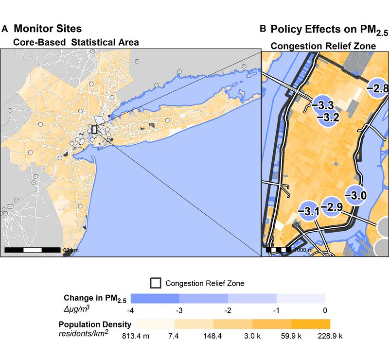
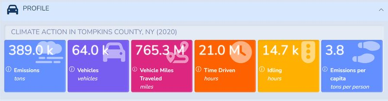
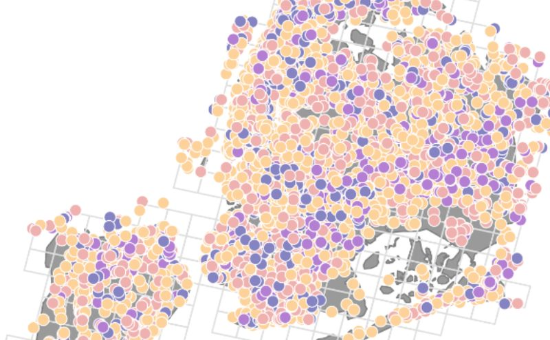

  

# Fraser Labs

**Public-interest data systems, built to run in production.**

Fraser Labs is Tim Fraser's research group in the Systems Engineering program at
Cornell University. We build the databases, APIs, models and dashboards that let
cities, agencies and the public answer environmental questions with real data:
Is the air getting cleaner? What do our roads emit? Which neighborhoods have the
community spaces that help people weather a disaster?

Our users are local decision-makers, planners, researchers and residents: people
who need a clear answer and can't run a heavyweight model themselves.

[timothyfraser.com](https://timothyfraser.com) ·
[Cornell profile](https://www.duffield.cornell.edu/people/timothy-fraser/) ·
[cat-apps.com](https://cat-apps.com)

---

## What we build

### Air quality and congestion pricing: CIVIC

When a city charges drivers to enter its core, does the air actually get cleaner,
and for whom? CIVIC brings together air-quality, transit and traffic data from
cities like New York, London and Stockholm, and uses causal inference to measure
how transportation policy changes pollution and mobility. The New York work is
published in *npj Clean Air*
([paper](https://doi.org/10.1038/s44407-025-00037-2)).

 

### Transportation emissions: MOVESAI and the CAT platform

EPA's MOVES model is the standard for estimating transportation emissions, but
it is slow and hard for non-experts to run. MOVESAI uses machine learning to
reproduce it behind fast APIs, and the Climate Action in Transportation (CAT)
platform puts those estimates in a dashboard any county or city can use.
Try it at **[cat-apps.com](https://cat-apps.com)**.

### Social infrastructure: the community spaces that hold cities together

Parks, libraries, places of worship and community centers are where neighbors
build the ties that carry them through disasters. We map and score these civic
spaces across Boston, Fukuoka and the 25 largest US cities, then link those
scores to hazard exposure and evacuation behavior, so planners can see which
neighborhoods are rich in community space and which are not. The Boston study is
published in *Urban Climate*
([paper](https://doi.org/10.1016/j.uclim.2022.101287)).

 

---

## How we work

- **Production, not practice.** Master of Engineering students work on the real
  systems above, with real users, from their first week.
- **Contract-driven.** Every piece of work is a task with an owner and a written
  definition of done, tracked in one shared contract file. Work lands through
  reviewed pull requests.
- **Agent-assisted.** We build with AI coding agents as everyday tools, under the
  same review and security rules as everyone else.

Interested in joining? Cornell MEng students can reach Tim through
[timothyfraser.com](https://timothyfraser.com).

---

## Who runs the lab

**Dr. Timothy Fraser** is an Assistant Teaching Professor of Systems Engineering
at Cornell University and Coordinator for the Center for Transportation,
Environment, and Community Health (CTECH). He is a computational social
scientist who builds methods, systems and software to help communities respond
to environmental crises.

[timothyfraser.com](https://timothyfraser.com) ·
[Cornell profile](https://www.duffield.cornell.edu/people/timothy-fraser/) ·
[GitHub](https://github.com/timothyfraser)

 

---

Text and images adapted from Tim's own site,
[timothyfraser.com](https://timothyfraser.com)
(source: [timothyfraser/timothyfraser.github.io](https://github.com/timothyfraser/timothyfraser.github.io)).
